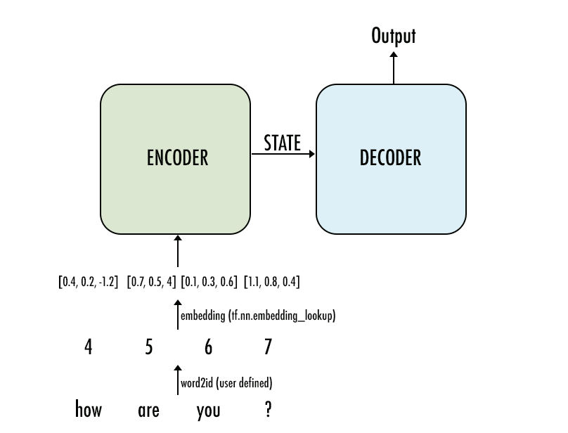

In this project, I'm going to take a peek into the realm of neural network machine translation. I'lll be training a sequence to sequence model on a dataset of English and French sentences that can translate new sentences from English to French.

# Inputs

When we want our model to do inference, we need to feed it an input sequence. Let's assume we're building a chatbot, and that our sequences will be words. We need to first convert the words to a proper numeric representation that the network can use for its computations. This conversion is done using `tf.nn.embedding_lookup` which we can use (after some processing of our data) to turn the words into vectors.

These models work a lot better if we feed the decoder our target sequence regardless of what its timesteps actually output in the training run. So unlike in the inference graph, we will not feed the output of the decoder to itself in the next timestep. Before the model trains on samples, the data needs to be preprocessed.

The sequence to sequence model actually works like this:

Where the input sentence is tokenized, the words are replaced by their ids, and then each id is replaced by its embedding. This in turn goes as input to the encoder.

# Results
After building and training the encoder and the decoder, I'm able to translate sentences from english to french:

"Paris is sometimes warm during june, but it is usually hot in july." becomes "Paris est parfois chaud en juin, mais il est généralement chaud en juillet".

The translation is not perfect, since the vocabulary of 227 english words.
