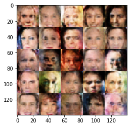

In the final project of the deep learning nanodegree, I implement a pair of multi-layer neural networks and make them compete against each other in order to generate new, realistic faces. I am training them on a set of celebrity faces, and see what new faces the computer comes out with!

To test the architecture, I first train it to generate new numbers from the mnist dataset. After confirming it works, I move on to generate new faces. At the beginning of the training, faces look like this:

And in the end faces look like this:

